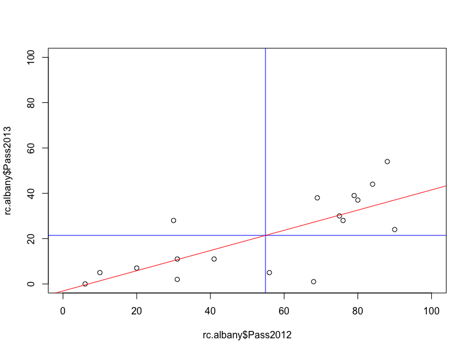
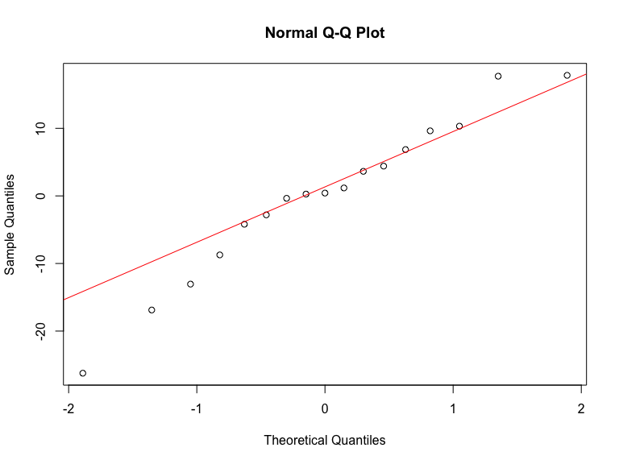

# Linear Regression with NYS Report Card
Jason M. Bryer, Ph.D.  
November 17, 2014  

## Data Preparation

The dataset contains grade 8 math scores for Albany County
 

```r
load('../Data/NYSReportCardAlbany.Rda')
rc.albany <- rc.albany[,c('School','Pass2012','Pass2013')]
print(rc.albany, row.names=FALSE)
```

```
##                                         School Pass2012 Pass2013
##                           NORTH ALBANY ACADEMY        6        0
##                WILLIAM S HACKETT MIDDLE SCHOOL       20        7
##        STEPHEN AND HARRIET MYERS MIDDLE SCHOOL       31       11
##                KIPP TECH VALLEY CHARTER SCHOOL       90       24
##             ACHIEVEMENT ACADEMY CHARTER SCHOOL       68        1
##  BERNE-KNOX-WESTERLO JUNIOR-SENIOR HIGH SCHOOL       31        2
##                BETHLEHEM CENTRAL MIDDLE SCHOOL       79       39
##          RAVENA-COEYMANS-SELKIRK MIDDLE SCHOOL       76       28
##                           COHOES MIDDLE SCHOOL       56        5
##                       SAND CREEK MIDDLE SCHOOL       80       37
##                       LISHA KILL MIDDLE SCHOOL       75       30
##                                 MENANDS SCHOOL       30       28
##                      SHAKER JUNIOR HIGH SCHOOL       88       54
##                                  HEATLY SCHOOL       10        5
##                       FARNSWORTH MIDDLE SCHOOL       84       44
##                    VOORHEESVILLE MIDDLE SCHOOL       69       38
##           WATERVLIET JUNIOR-SENIOR HIGH SCHOOL       41       11
```

## What we wish to estimate:

$$Pass_{2013} = {b}_{1}Pass_{2012} + {b}_{0}$$


```r
plot(rc.albany$Pass2012, rc.albany$Pass2013, xlim=c(0,100), ylim=c(0,100))
```

 

## Descriptive Statistics


$$ { mean }_{ x }=\overline { x } =\frac { \sum { { x }_{ i } }  }{ n } $$


```r
(mean2012 <- mean(rc.albany$Pass2012))
```

```
## [1] 54.94
```

```r
(mean2013 <- mean(rc.albany$Pass2013))
```

```
## [1] 21.41
```

$$ Variance_{ x }={ s }_{ x }^{ 2 }=\frac { \sum { ({ x }_{ i }-\overline { x }  } )^{ 2 } }{ n-1 }  $$


```r
var(rc.albany$Pass2012)
```

```
## [1] 824.2
```

```r
var(rc.albany$Pass2013)
```

```
## [1] 298.9
```

$$ { Standard\quad Deviation }_{ x }=s=\sqrt { { s }^{ 2 } } $$


```r
(sd2012 <- sd(rc.albany$Pass2012))
```

```
## [1] 28.71
```

```r
(sd2013 <- sd(rc.albany$Pass2013))
```

```
## [1] 17.29
```

Number of Rows (n)


```r
(n <- nrow(rc.albany))
```

```
## [1] 17
```

## z-Scores

$$ z=\frac { y-\overline { y }  }{ s } $$


```r
rc.albany$Pass2012.z <- (rc.albany$Pass2012 - mean2012) / sd2012
rc.albany$Pass2013.z <- (rc.albany$Pass2013 - mean2013) / sd2013
print(rc.albany[,-1], row.names=FALSE)
```

```
##  Pass2012 Pass2013 Pass2012.z Pass2013.z
##         6        0   -1.70476    -1.2385
##        20        7   -1.21710    -0.8336
##        31       11   -0.83394    -0.6022
##        90       24    1.22120     0.1497
##        68        1    0.45487    -1.1807
##        31        2   -0.83394    -1.1228
##        79       39    0.83804     1.0174
##        76       28    0.73354     0.3811
##        56        5    0.03688    -0.9493
##        80       37    0.87287     0.9017
##        75       30    0.69870     0.4968
##        30       28   -0.86877     0.3811
##        88       54    1.15153     1.8850
##        10        5   -1.56543    -0.9493
##        84       44    1.01220     1.3066
##        69       38    0.48971     0.9595
##        41       11   -0.48561    -0.6022
```

## Correlation

$$ r=\frac { \sum { { z }_{ x }{ z }_{ y } }  }{ n-1 } $$


```r
rc.albany$ZProduct <- rc.albany$Pass2012.z * rc.albany$Pass2013.z
r <- sum( rc.albany$ZProduct ) / ( n - 1 )
r
```

```
## [1] 0.7408
```

```r
print(rc.albany[,-1], row.names=FALSE)
```

```
##  Pass2012 Pass2013 Pass2012.z Pass2013.z ZProduct
##         6        0   -1.70476    -1.2385  2.11137
##        20        7   -1.21710    -0.8336  1.01459
##        31       11   -0.83394    -0.6022  0.50224
##        90       24    1.22120     0.1497  0.18283
##        68        1    0.45487    -1.1807 -0.53706
##        31        2   -0.83394    -1.1228  0.93637
##        79       39    0.83804     1.0174  0.85258
##        76       28    0.73354     0.3811  0.27954
##        56        5    0.03688    -0.9493 -0.03501
##        80       37    0.87287     0.9017  0.78704
##        75       30    0.69870     0.4968  0.34709
##        30       28   -0.86877     0.3811 -0.33107
##        88       54    1.15153     1.8850  2.17063
##        10        5   -1.56543    -0.9493  1.48606
##        84       44    1.01220     1.3066  1.32251
##        69       38    0.48971     0.9595  0.46988
##        41       11   -0.48561    -0.6022  0.29246
```

## Correlation (cont.)


```r
cor.test(rc.albany$Pass2012, rc.albany$Pass2013)
```

```
## 
## 	Pearson's product-moment correlation
## 
## data:  rc.albany$Pass2012 and rc.albany$Pass2013
## t = 4.271, df = 15, p-value = 0.0006703
## alternative hypothesis: true correlation is not equal to 0
## 95 percent confidence interval:
##  0.4039 0.9007
## sample estimates:
##    cor 
## 0.7408
```

## Slope

$$ m = r \frac{s_y}{s_x} $$


```r
m <- r * (sd2013 / sd2012)
m
```

```
## [1] 0.4461
```

## Intercept:


```r
b <- mean2013 - m * mean2012
b
```

```
## [1] -3.096
```

## Draw Regression Line


```r
plot(rc.albany$Pass2012, rc.albany$Pass2013, xlim=c(0,100), ylim=c(0,100))
abline(h=mean2013, col='blue')
abline(v=mean2012, col='blue')
abline(a=b, b=m, col='red')
```

 

## Residuals


```r
rc.albany$Predicted2013 <- m * rc.albany$Pass2012 + b
rc.albany$Residual <- rc.albany$Pass2013 - rc.albany$Predicted2013
print(rc.albany[,-1], row.names=FALSE)
```

```
##  Pass2012 Pass2013 Pass2012.z Pass2013.z ZProduct Predicted2013 Residual
##         6        0   -1.70476    -1.2385  2.11137       -0.4198   0.4198
##        20        7   -1.21710    -0.8336  1.01459        5.8253   1.1747
##        31       11   -0.83394    -0.6022  0.50224       10.7321   0.2679
##        90       24    1.22120     0.1497  0.18283       37.0508 -13.0508
##        68        1    0.45487    -1.1807 -0.53706       27.2370 -26.2370
##        31        2   -0.83394    -1.1228  0.93637       10.7321  -8.7321
##        79       39    0.83804     1.0174  0.85258       32.1439   6.8561
##        76       28    0.73354     0.3811  0.27954       30.8057  -2.8057
##        56        5    0.03688    -0.9493 -0.03501       21.8841 -16.8841
##        80       37    0.87287     0.9017  0.78704       32.5900   4.4100
##        75       30    0.69870     0.4968  0.34709       30.3596  -0.3596
##        30       28   -0.86877     0.3811 -0.33107       10.2860  17.7140
##        88       54    1.15153     1.8850  2.17063       36.1586  17.8414
##        10        5   -1.56543    -0.9493  1.48606        1.3645   3.6355
##        84       44    1.01220     1.3066  1.32251       34.3743   9.6257
##        69       38    0.48971     0.9595  0.46988       27.6831  10.3169
##        41       11   -0.48561    -0.6022  0.29246       15.1929  -4.1929
```

## Residual Plot


```r
plot(rc.albany$Pass2012, rc.albany$Residual)
abline(h=0)
```

 

## Histogram of Residuals


```r
hist(rc.albany$Residual)
```

 

## Quantile-Quantile Plot


```r
qqnorm(rc.albany$Residual)
qqline(rc.albany$Residual, col=2)
```

 

## Final Regression Line and $R^2$

$$ Pass_{2013} = 0.45 * Pass_{2012} - 3.1 $$


```r
r ^ 2
```

```
## [1] 0.5487
```

The mean score from 2012 accounts for 54.9% of the variance in the mean score from 2013 in math at grade 8.


## Regression in R


```r
lm.out <- lm(Pass2013 ~ Pass2012, data=rc.albany)
summary(lm.out)
```

```
## 
## Call:
## lm(formula = Pass2013 ~ Pass2012, data = rc.albany)
## 
## Residuals:
##    Min     1Q Median     3Q    Max 
## -26.24  -4.19   0.42   6.86  17.84 
## 
## Coefficients:
##             Estimate Std. Error t value Pr(>|t|)    
## (Intercept)   -3.096      6.434   -0.48  0.63729    
## Pass2012       0.446      0.104    4.27  0.00067 ***
## ---
## Signif. codes:  0 '***' 0.001 '**' 0.01 '*' 0.05 '.' 0.1 ' ' 1
## 
## Residual standard error: 12 on 15 degrees of freedom
## Multiple R-squared:  0.549,	Adjusted R-squared:  0.519 
## F-statistic: 18.2 on 1 and 15 DF,  p-value: 0.00067
```
